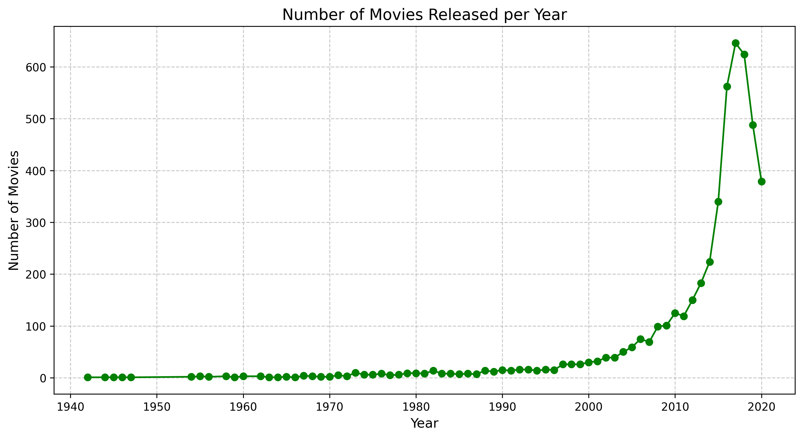

# 🎬 Netflix Movies Analysis

This project explores the **Netflix Movies dataset** to uncover insights about movie trends, genres, and durations.  
The analysis was performed in **Python** using **pandas, matplotlib**, and follows best practices in data analysis.

---

## 📊 Project Goals
1. Perform exploratory data analysis (EDA) on Netflix movies.  
2. Answer key questions, such as:
   - What was the most frequent movie duration in the 1990s?  
   - How many short action movies (< 90 minutes) were released in the 1990s?  
3. Visualize movie trends across years and genres.  

---

## 📂 Project Structure
    netflix-analysis/
    ├─ data/
    │ └─ raw/netflix_data.csv
    ├─ notebooks/
    │ └─ analysis.ipynb
    ├─ charts/
    │ ├─ top_10_movie_genres.png
    │ └─ movies_released_per_year.png
    │ └─ movie_distribution_by_duration.png
    ├─ README.md
    └─ requirements.txt

---

## 🛠️ Technologies Used
- Python 3.11  
- Pandas  
- Matplotlib  

---

## 📈 Key Insights

### 1. Movie Duration in the 1990s
- The most frequent movie duration was **`94 minutes`**.  
- Number of short action movies (< 90 minutes): **`7 movies`**.  

---

### 2. Top 10 Genres
  

- Action, Drama and Comedy dominate Netflix’s catalog.  

---

### 3. Movie Releases per Year
  

- The number of movies released grew exponentially after the 2000s.  
- 2019 marks the peak, followed by a sharp decline in 2020–2021.  
- This drop is likely due to **incomplete data for recent years** and the impact of the **COVID-19 pandemic** on movie production.  

---

## 👤 Author
- **Bogdan Cenușa**  
  📍 Alba Iulia, Romania  
  🔗 [LinkedIn](https://www.linkedin.com/in/bogdan-cenusa/)  